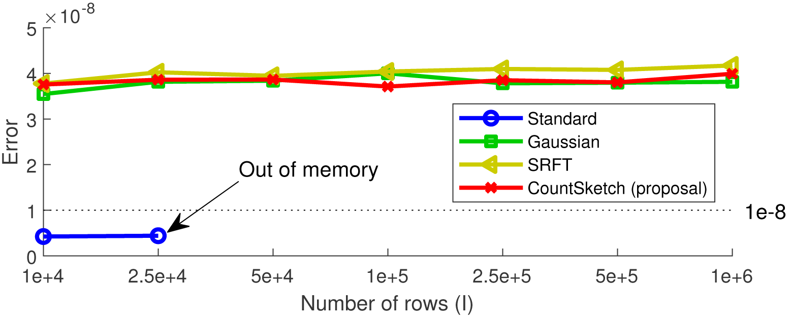
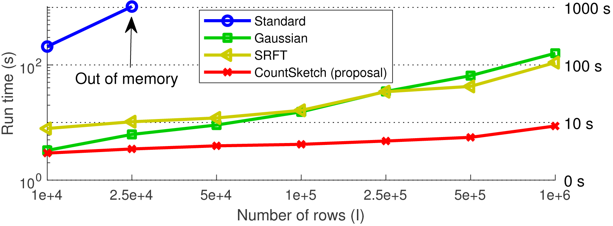
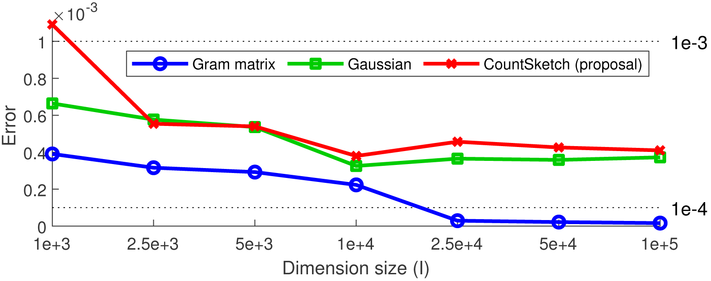
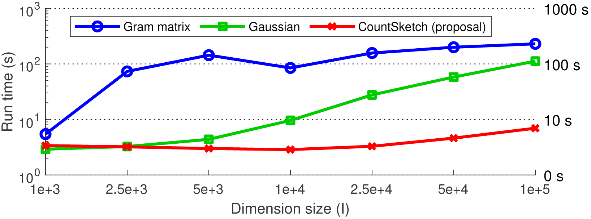

# CountSketch Matrix and Tensor Interpolative Decomposition
This repository provides the code we used in our preprint paper 

[TBA]

It is available at [TBA].

## Some further details
In our paper, we propose a new fast randomized algorithm for interpolative decomposition (ID) of matrices utilizing the CountSketch technique. We then extend our method to the recently proposed tensor ID problem. This repository provides all the code we used in our experiments in the paper, including implementations of our proposed CountSketch matrix and tensor ID algorithms which are provided in the functions **CS_matrix_ID.m** and **CS_tensor_ID.m**, respectively.

## Requirements
Parts of our code relies on the following software:
* Tensor Toolbox version 2.6 by Bader, Kolda and others (available at http://www.sandia.gov/~tgkolda/TensorToolbox/).
* RSVDPACK by Voronin and Martinsson (available at https://github.com/sergeyvoronin/LowRankMatrixDecompositionCodes).
* Interpolative Decomposition based on Strong RRQR by Xin Xing (available at https://www.mathworks.com/matlabcentral/fileexchange/69352-interpolative-decomposition-based-on-strong-rrqr).

## Installation
The mex files can be compiled by using the standard Matlab mex commands. For the other software listed above, please see the instructions provided with each of them. 

## Experiments
The four script files **run_experiment_n.m** (where n = 1, 2, 3, 4), can be used to reproduce our experiments. Each experiment is described below.
* **Experiment 1:** This experiment compares standard matrix ID, Gaussian matrix ID, SRFT matrix ID, and two versions of our proposed CountSketch matrix ID (with strongly rank-revealing QR, or with column pivoted QR). It can be set up so that the test matrices are either dense with a specific structure, or just random sparse matrices with no particular structure aside from sparsity. Our paper does not include any results from this experiment.
* **Experiment 2:** This experiment compares standard matrix ID, Gaussian matrix ID, SRFT matrix ID, and our proposed CountSketch matrix ID (with column pivoted QR). The test matrices in this experiment are sparse, with a specific structure. The figure below shows results from this experiment that are included in our paper.

* **Experiment 3:** This experiment compares Gaussian matrix ID, SRFT matrix ID, and our proposed CountSketch matrix ID (with column pivoted QR). The decomposed matrix is a real-world matrix. In our paper, we use the matrix *specular* matrix, which is available at https://sparse.tamu.edu/Brogan/specular. The table below shows results from this experiment that are included in our paper.

| Algorithm | Error | Run time (s) |
| --- | --- | --- |
| Gaussian | 1.505e-15 | 20.38 |
| SRFT | 1.507e-15 | 18.40 |
| CountSketch (proposal) | 1.504e-15 | 0.59 |
* **Experiment 4:** This experiment compares tensor ID using the Gram matrix approach, Gaussian tensor ID, and CountSketch tensor ID. The test tensors in this experiment are sparse CP tensors with a specific structure. The figure below shows results from this experiment that are included in our paper.

## Referencing this code
If you use our code in any of your own work, please provide a reference this repository. If you use CountSketch matrix or tensor ID, please also provide a reference to our paper. 

Most of the code in this repository is implementations of algorithms invented by other researchers. We have done our best to include relevant references in the comments of our code.

## Author contact information
Please feel free to contact me at any time if you have any questions or would like to provide feedback on this code or on our paper. I can be reached at osman.malik@colorado.edu.